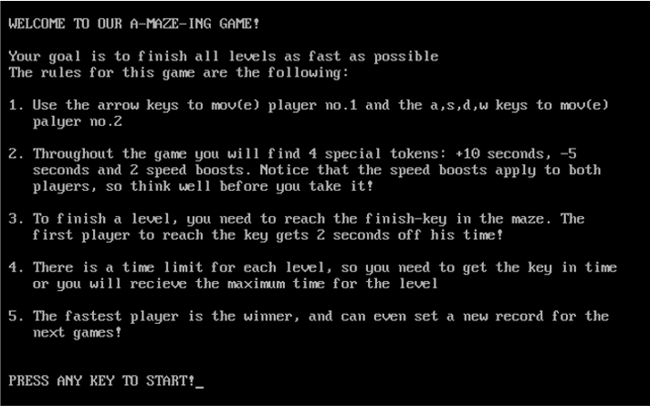
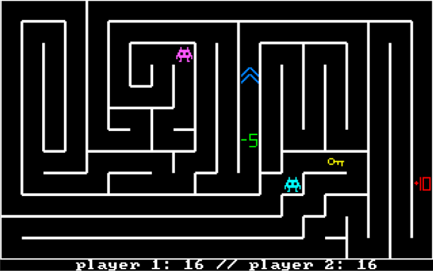
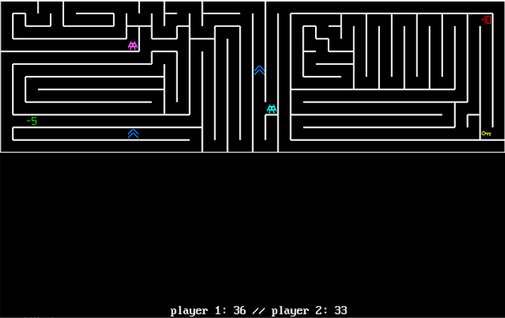
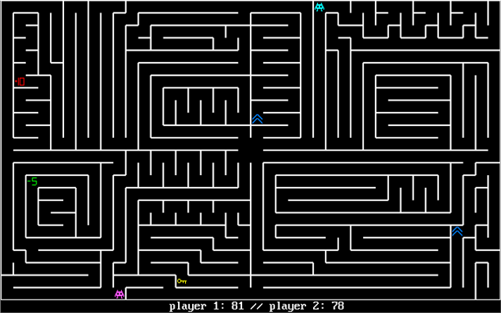

# Recursive Backtracking Assembly Game
**Random** maze solving game generated with **recursive backtracking** implemented in **Assembly** for our **final project** in Assembly course.

## Photos

## Tasks
- [x] ~~Character rendering - Omri~~ 
- [x] ~~Maze generation algorithm - Omri~~
- [x] ~~Functioning borders - Omri~~
- [x] ~~Character rendering - Omri~~
- [x] ~~Rewriting the rendering system - Omri~~
- [x] ~~Some sort of level system - Omri~~
- [x] ~~Score system - Aylon~~
- [x] ~~Timer - Both~~
- [x] ~~Better player character - Aylon~~
- [x] ~~Token Generation - Omri~~
- [x] ~~Tokens design - Aylon~~
- [x] ~~Adjusting the tokens' abilities - Aylon~~
- [x] ~~Welcome & Menu page - Aylon~~
- [x] ~~Score board at the end of the game - Aylon~~
- [x] ~~Adding a second player to the game - Aylon~~
- [x] ~~Parallel movement of the two players - Aylon~~
- [x] ~~Updating the picture in the project's page - Aylon~~
- [x] ~~Code overview and cleanup - Aylon~~
